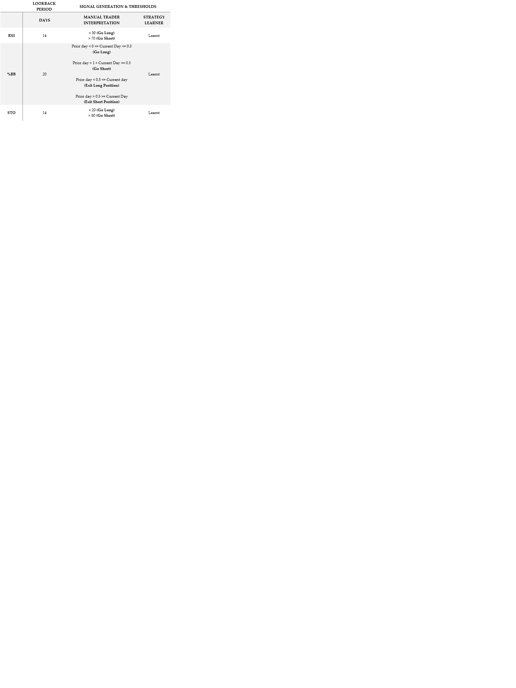

# 📈 Machine Learning-Based Stock Trading Engine
Machine Learning algorithms generally excel in recognizing patterns in data, and can identify complex, nonlinear relationships that traditional statistical models may miss. They can analyze datasts with many variables (features) without the need to simplify the problem space, making them powerful for scenarios like image recognition, genomic data, and financial markets.

Specifically, they are suited to learn from new data and adapt over time, improving predictions as patterns evolve. This is particularly useful for time-series data such as with stock trading.

## 🧠 Project Overview

This project develops a **Machine Learning** based financial stock trader that learns trading strategies from historical stock performance and financial technical indicators data and makes trading recommendations for a given stock portfolio using classification algorithms. The project also develops a manual stock trader based on rule-based, hand-coded logic using the same technical indicators to highlight their power. The performance of both the manual and AI-learning algorithms are then compared to a naive benchmark trader that simply employs a "buy-and-hold" strategy for the duration of the evaluation period.

A series of experiments explore in-sample and out-of-sample results, market impact, and overfitting.

## 🔧 Technical Indicators Used

- **RSI (Relative Strength Index)**
- **% Bollinger Bands**
- **Stochastic Oscillator**

These indicators were selected for their diversity and combined using majority voting in the manual strategy. The parameters and thresholds for these indicators are summarized below:

## ⚙️ Manual Strategy

A rule-based strategy combining indicator thresholds with:
- Voting logic for buy/sell signals
- Position exit rules using Bollinger Band crossovers
- Position size capped at 1,000 shares

## 🌲 Strategy Learner (ML)

Implemented as a **Random Forest Classifier** using:
- Indicators as features
- Custom labeling scheme based on N-day forward returns
- Tunable hyperparameters: `N`, `YBUY`, `YSELL`, `LeafSize`, `Bags`, and exit strategy
- Hyperparameters tuned using cross-validation across 5 symbols

## 📊 Experiment 1: Comparison of overall returns

| Strategy      | In-Sample Return | Out-of-Sample Return |
|---------------|------------------|-----------------------|
| Manual        | 16.5%            | 2.8%                  |
| Strategy ML   | **125.6%**       | 1.4%                  |
| Benchmark     | 1.2%             | -8.4%                 |

> 📌 Strategy Learner outperformed significantly in-sample. Manual strategy was more robust out-of-sample.

## 🧪 Experiment 2: Market Impact Sensitivity
To make the project more real-world, market impact was introduced as a factor for the strategy learner as a separate experiment. Since strategy learner accounts for impact as part of its learning, it was hypothesized that as impact increases, both cumulative returns and number of trades decreases.

| Market Impact | Cumulative Return | Trades |
|---------------|-------------------|--------|
| 0.000         | 157.6%            | 94     |
| 0.005         | 102.7%            | 53     |
| 0.010         | 85.1%             | 43     |

> 📉 As expected, increasing market impact reduced trading frequency and profitability.

## 📁 Project Structure

- `ManualStrategy.py`: Rule-based trading logic
- `StrategyLearner.py`: ML-based learner using Random Forest
- `indicators.py`: Computes RSI, %B, STO
- `marketsim.py`: Simulates portfolio performance
- `testproject.py`: Runs both strategies and generates results
- `report.docx`: Full write-up of the project and experiments

## 📚 References

- [Technical Indicators – StockCharts](https://school.stockcharts.com/doku.php?id=technical_indicators)
- [Wikipedia: Technical Indicator](https://en.wikipedia.org/wiki/Technical_indicator)

---
