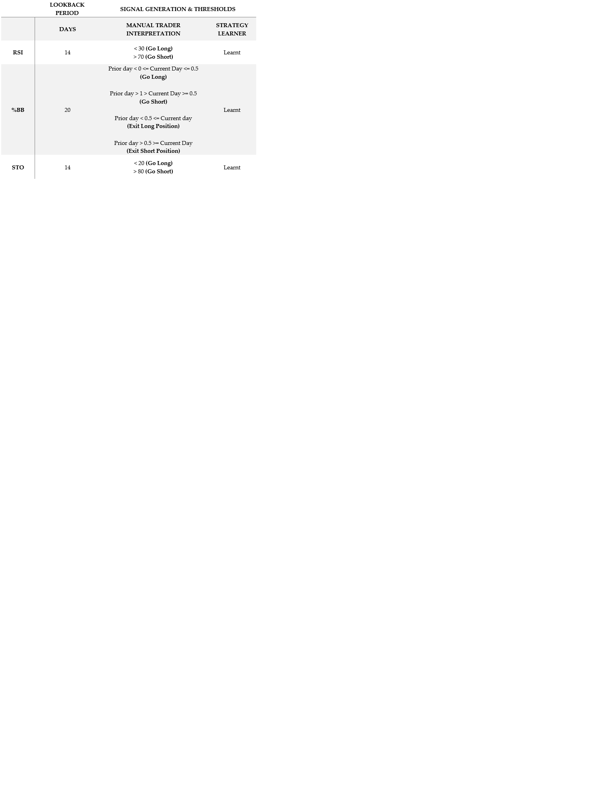

# 📈 Machine Learning-Based Stock Trading Engine
Machine Learning algorithms generally excel in recognizing patterns in data, and can identify complex, nonlinear relationships that traditional statistical models may miss. They can analyze datasets with many variables (features) without the need to simplify the problem space, making them powerful for scenarios like image recognition, genomic data, and financial markets.

Specifically, they are suited to learn from new data and adapt over time, improving predictions as patterns evolve. This is particularly useful for time-series data such as with stock trading.

## 🧠 Project Overview

This project develops a **Machine Learning** based financial stock trader that learns trading strategies from historical stock performance and financial technical indicators data and makes trading recommendations for a given stock portfolio using classification algorithms. The project also develops a manual stock trader based on rule-based, hand-coded logic using the same technical indicators to highlight their power. The performance of both the manual and AI-learning algorithms are then compared to a naive benchmark trader that simply employs a "buy-and-hold" strategy for the duration of the evaluation period.

A series of experiments explore in-sample and out-of-sample results, market impact, and overfitting.

## 🔧 Technical Indicators Used

- **RSI (Relative Strength Index)**
- **% Bollinger Bands**
- **Stochastic Oscillator**

These indicators were selected for their diversity and combined using majority voting in the manual strategy. The parameters and thresholds for these indicators are summarized below:

